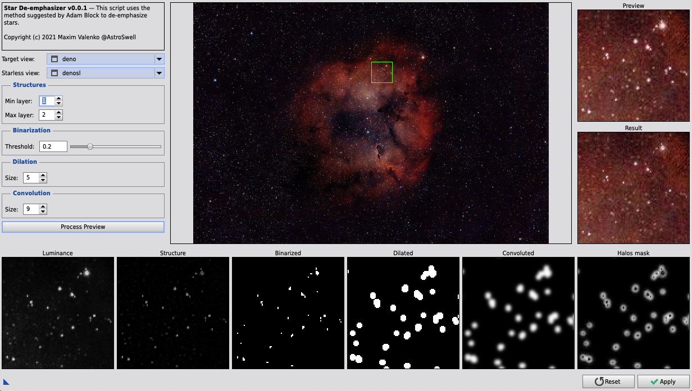

# Star De-emphasizer Script for PixInsight

### Introduction

This script uses the method of de-emphasizing stars suggested by Adam Block (https://adamblockstudios.com/). The basic idea is that we need to create a so-called "halos" mask in order to fill the space around each star with the data from the starless image.

The recommended way to obtain a starless image is by using Starnet++ process. But there are other ways too.

I highly recommend watching Adam Block's presentation on his method https://www.youtube.com/watch?v=3DdSDoJfjM4

### Download

The script can be downloaded on the [Releases page](https://github.com/beshanoe/pixinsight-star-de-emphasizer/releases)

[Download Latest](https://github.com/beshanoe/pixinsight-star-de-emphasizer/releases/download/v0.0.1/StarDe-emphasizer.zip)

### Method

The method consists of the following steps:

1. Get starful image's luminance
2. Apply MultiscaleLinearTransform to it in order to extract structures(stars) of a certain size
3. Apply Binarize process to that
4. Apply MorphologicalTransformation(Dilation) in order to make binarized stars uniform and round
5. Apply Convolution to smooth dilated stars' edges
6. Subtract the luminance image from the convolved image. This way we get a halos mask
7. Apply the starless image to the starful image through the halos mask
8. Enjoy the result or adjust the parameters and retry :)

### Usage

The interface of the script allows you to see how each stage of the process modifies the image.

1. Choose the target image and its corresponding starless image
1. Select a preview area on the main preview image by clicking the mouse and scrolling to zoom in.
1. Press the "Process Preview" button
1. You can press the mouse on the "Result" area to compare the result with the original
1. Adjust parameters and press "Process Preview" again to see the changes in some of the stages previews and the resulting image
1. When you're ready, press the "Apply" button to start the process on the target image
1. Close the script

### Suggestions and improvements

If you have any suggestions or feedback on how to improve this script please open an issue in this repository 😉
